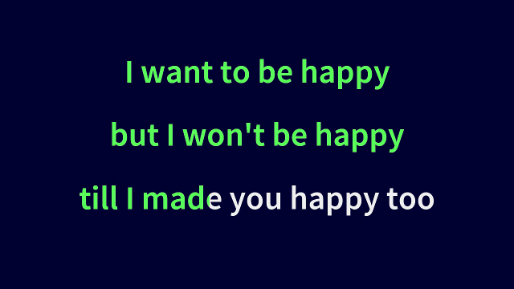

KaraOkay
========

Produce an okay karaoke movie from a text file
--------------------------------------------------

### What is does

KaraOkay converts a text file and the half playback of the song you want
to sing on your next karaoke party to a movie which provides the lyrics
and music for your memorable performance.

Text text file will look a bit like this:

```
# Duration: 2:45.75
-- 13.7 - 24.3
I want to be happy
but I won't be happy
til I made you happy too
-- 26.3 - 35
Life's really worth living
When we are mirth-giving
Why can't I give some to you
```

and the generated movie may look something like this:



### How it's done

The movie is produced invoking a python command with the text file and
the half-playback of the song:

```
$> python KaraOkay.py happy.kok -a happy.mp3
```

Where _happy.kok_ is the name of text file and _happy.mp3_ is the audio
file. Don't worry, the file extension *.kok does not mean anything, but
sounds funny. This will produce a movie named _happy.mp4_, unless you
come up with an other name using the -o option.

Talking about options, let's have a look at them:

```
$> python KaraOkay.py -h
usage: KaraOkay.py [-h] [-o OUTFILE] [-a AUDIOFILE] [-f FONTFILE] [--force]
                   [--debug] [--suppress-plug]
                   filename

Produce an okay karaoke movie from a text file. See README.md.

positional arguments:
  filename              Input file to process. May be ending with .kok.

optional arguments:
  -h, --help            show this help message and exit
  -o OUTFILE, --outfile OUTFILE
                        Name of the movie file. it should end in .mp4. If none
                        given, a filename is guessed from the input file.
  -a AUDIOFILE, --audiofile AUDIOFILE
                        Path to the audio file to play in the movie. If none
                        given, the movie remains silent.
  -f FONTFILE, --fontfile FONTFILE
                        Path to a font file usable by pygame. Defaults to
                        ./fonts/SourceSansPro-Semibold.ttf
  --force               If set, an existing movie may be overriden.
  --debug               If set, the current time is rendered on every frame
                        and the text with timings is printed to stdout.
  --suppress-plug       If set, the plug after the last slide will not be
                        shown.
```

The probably most interesting one is the --debug option. It not only
renders the current time on every frame of the movie, which may be
helpfull figuring out the right timing, but also prints the times for
every line which are calculated on the go:

```
# Duration: 165.0
-- 13.70 - 24.30
[13.70]I want to be happy[17.23]
[17.23]but I won't be happy[20.76]
[20.76]til I made you happy too[24.30]
```

You may ommit any timestamp you want (apart from the ones in the first 
line of the card, starting with "--"), they will be guessed by best
effort and you can check the result of the guess work with the --debug
option, or by just watching the movie.

This gives a glimpse on what you can do, if you go really crazy:

```
-- 26.30 - 35.00
Life's really worth living
When we are mirth-giving[31]
[32]Why can't [33]I give[34.6] some to you
```

You'll be suprised how ok these movies turn out, if you just give the
start and end time of whole sections. It's going to be kara-okay.
Ba-dum-tssss.

### Download

Head to (KaraOkay's project page)[https://github.com/kara-okay/karaokay],
and clone or download the git repository. Chances are pretty good you're 
already on this page, if you're reading this online
Don't worry, if you don't know what a git repository is. Just head to the
upper right corner of the webpage, click the green button "Clone or
donwload" and download the ZIP file.

### Installation

This is a tiny [python 3](https://www.python.org/) script, standing on
the shoulders of giants. It conjures the magic of
[pygame](https://www.pygame.org/wiki/GettingStarted) to do the graphics
and the sourcery of [moviepy](https://pypi.org/project/moviepy/) (and
thus [ffmpeg](https://ffmpeg.org/)) to create the movies.

Here's the installation process in the ideal
"[pip](https://pypi.org/project/pip/) works just fine world", which
worked for me on a current GNU/Linux. Please read into the installation
instructions of the respective project, if you run into any trouble:

```
$> python3 -m pip install -U pygame --user
$> python3 -m pip install -U moviepy --user
```

### Licenses

This software is released under GNU General Public License, Version 3.
See COPYING.

The font Source Sans Pro is released under the SIL Open Font License.
See fonts/OFL.txt
